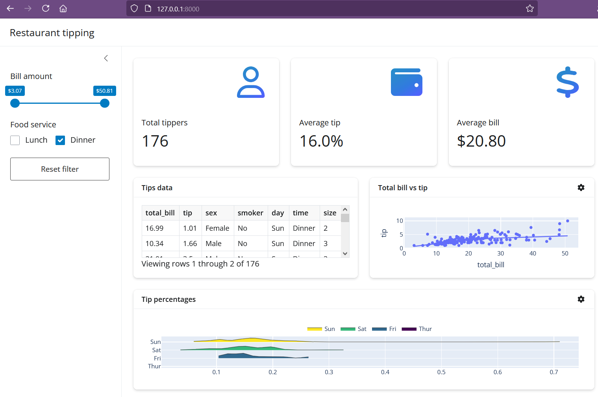

# shiny-restaurant-tips
Boilerplate Shiny data visualization app



Follow the official [documentation installation steps](https://shiny.posit.co/py/docs/install-create-run.html#install) under "Install".

You may need to install required packages by running:
```pip install -r requirements.txt```

Shiny app can be launched on your localhost (http://127.0.0.1:8000/) using the command: 
```shiny run basic-app/app.py ```

Note that the [demo dataset](https://plotly.com/python-api-reference/generated/plotly.data.html#plotly.data.tips) is built in to plotly.